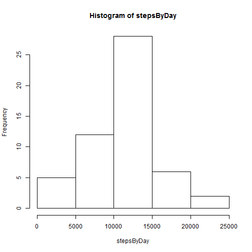
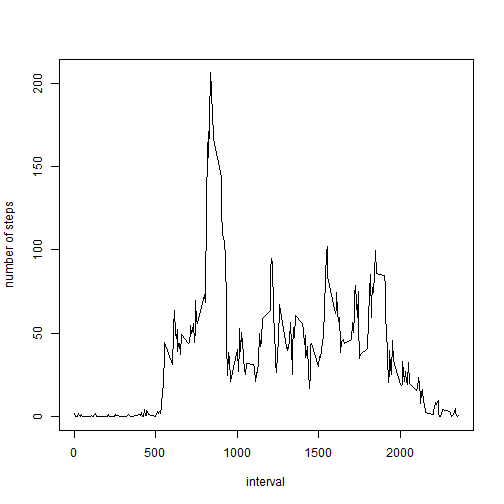
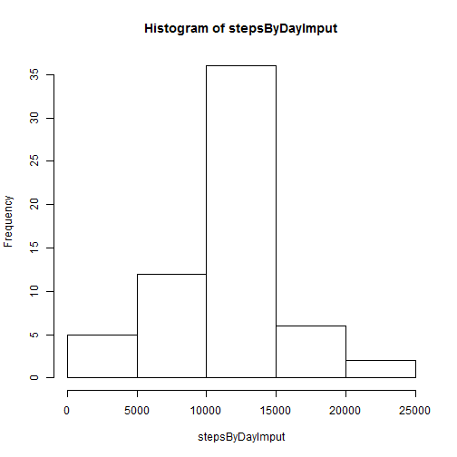
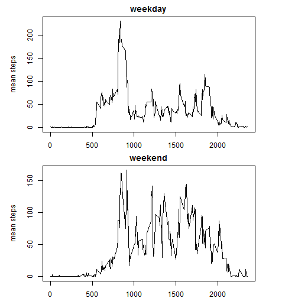

Assignment 1 - Reproducible Research
========================================================

### Loading the Data

The data is loaded into a new data frame object (DF):

```r
require(datasets)
require(lubridate)
```

```
## Loading required package: lubridate
```

```r
require(lattice)
```

```
## Loading required package: lattice
```

```r
DF <- read.csv("activity.csv", header = TRUE)

```


# Total Steps per Day
The total number of steps per day were analyzed.  

The following code was used to calculate the total steps per day by making use of the with and tapply functions.  This value is plotted using a histogram.  


```r
# identify NA values
isBad <- is.na(DF$steps)

# creates a vector containing the sum of steps each day.
stepsByDay <- with(DF[!isBad, ], tapply(steps, date, sum))
hist(stepsByDay)
```

 


# Mean and Median Steps Per Day

The mean and median steps taken per day were analyzed.  These were calculated as follows:  


```r
# Calculates the mean number of steps each day.
meanSteps <- mean(stepsByDay, na.rm = TRUE)
print(meanSteps)
```

```
## [1] 10766
```

```r

# Calculates the median number of steps each day.
medianSteps <- median(stepsByDay, na.rm = TRUE)
print(medianSteps)
```

```
## [1] 10765
```


*On average (mean), the number of steps taken by participants in the dataset was 1.0766 &times; 10<sup>4</sup>.  The data is equally distributed on either side of its mean, with a median value of 10765*


# Mean Steps by Interval

To analyze the periods of the day that are the most active, we plot the average steps taken in each 5 minute interval throughout the entire sample period. 


```r
# creates a vector containing the mean number of steps for each interval.
avgStepsByInterval <- with(DF[!isBad, ], tapply(steps, interval, mean))
# plots mean number of steps for each time interval
plot(names(avgStepsByInterval), avgStepsByInterval, type = "l", ylab = "number of steps", 
    xlab = "interval")
```

 

```r

# calculate the interval with the largest average numbef of steps
names(avgStepsByInterval[avgStepsByInterval == max(avgStepsByInterval)])
```

```
## [1] "835"
```


**The 835th 5-minute interval had the largest average number of steps per day, at 206.1698**

# Imputing Missing Values

The dataset includes several missing values for step counts.  Values for these missing observations were imputed by taking the mean value of steps for that particular 5-minute interval, across the entire sample period.  The rationale for this decision is rooted in the expectation that individual step patterns tend to be similar from day to day, according to their usual routine.  A more complex method that takes into accounts variations across weekdays or weekends was not used, but may provide greater accuracy for imputed variables in future analysis. 

These values were imputed using the following code: 


```r

# Calculate and report the total number of missing values in the dataset
# (i.e. the total number of rows with NAs)
sum(isBad)
```

```
## [1] 2304
```

```r


# Creates a new dataset DF2, which includes no missing values.  The missing
# values for steps are imputed by assigning the mean number of steps
# observed for that interval across the entire sample period.

DF2 <- DF
for (i in seq_along(DF2$steps)) {
    if (is.na(DF2$steps[i])) {
        DF2$steps[i] <- avgStepsByInterval[as.character(DF2$interval[i]) == 
            names(avgStepsByInterval)]
    }
}


# Calculates and plots the total number of steps each day, with NA values
# imputed.
stepsByDayImput <- with(DF2, tapply(steps, date, sum))
hist(stepsByDayImput)
```

 

```r

# Calculates the mean number of steps each day, with NA values imputed.
meanStepsImput <- mean(stepsByDayImput, na.rm = TRUE)
print(meanStepsImput)
```

```
## [1] 10766
```

```r

# Calculates the median number of steps each day, with NA values imputed.
medianStepsImput <- median(stepsByDayImput, na.rm = TRUE)
print(medianStepsImput)
```

```
## [1] 10766
```


Imputing the average values for each interval has little influence on the mean and median values of the data.  The reason for this is due to the fact that values in the dataset tended to be missing for entire 24-hour periods, so imputing the average value by interval has little if any influence on the overall distribution of the data.  

# Analysis of Weekday versus Weekend Step Patterns

The differences in step patterns were examined between weekends and weekdays.  The following R code was implemented in order to create a new Matrix with data separated into weekdays and weekends: 


```r

# create a factor vector indicating if the day of the week is a weekend.
# Assign this to a column in the main DF2 dataframe.
DF2$weekend <- factor(weekdays(as.Date(DF2$date)) == "Saturday" | weekdays(as.Date(DF2$date)) == 
    "Sunday", labels = c("weekday", "weekend"))

# Use the new factor variable to calculate average steps.
avgStepsByWeekday <- with(DF2, tapply(steps, list(interval, weekend), mean))
```


The values of mean step counts by interval were graphed for both weekends and weekdays using the base graphics package in R.  The following code was used to produce a panel graph of weekend versus weekday mean steps by 5-minute interval throughout the day: 


```r

par(mar = c(2, 5, 2, 5))
par(mfcol = c(2, 1))
plot(avgStepsByWeekday[, 1] ~ as.numeric(rownames(avgStepsByWeekday)), type = "l", 
    ylab = "mean steps", xlab = "interval", main = "weekday")
plot(avgStepsByWeekday[, 2] ~ as.numeric(rownames(avgStepsByWeekday)), type = "l", 
    ylab = "mean steps", xlab = "interval", main = "weekend")
```

 


Analyzing the two charts, we see a more distributed pattern of steps throughout the day on weekends compared to weekdays.
